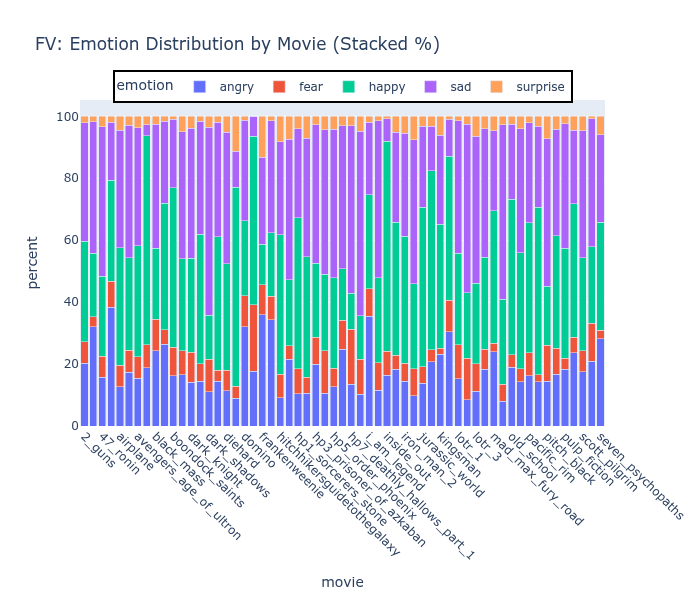
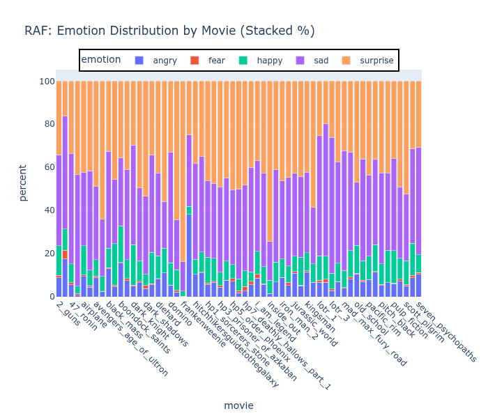
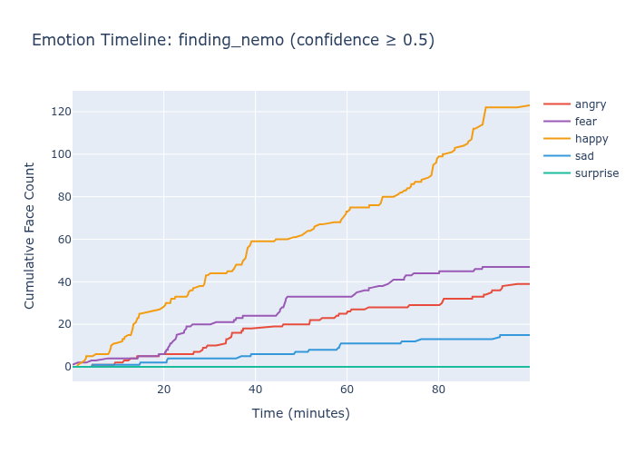
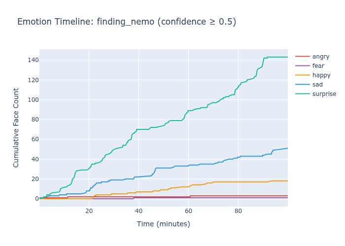
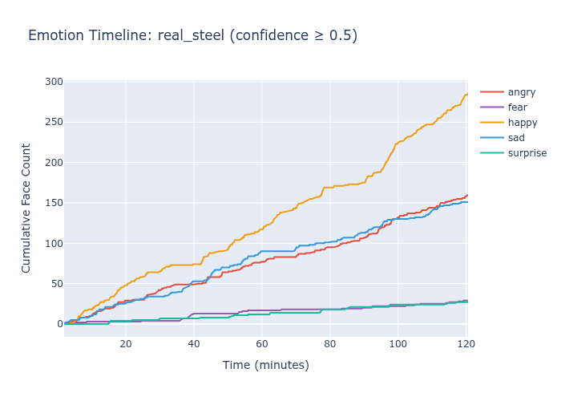
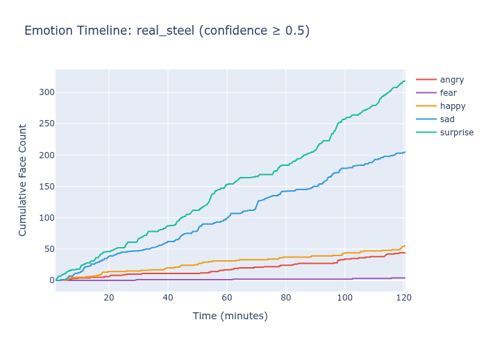
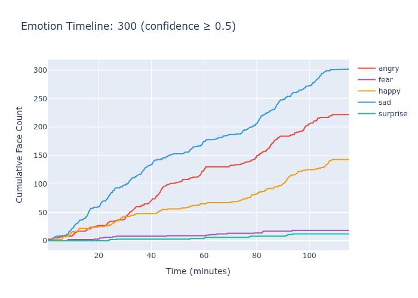
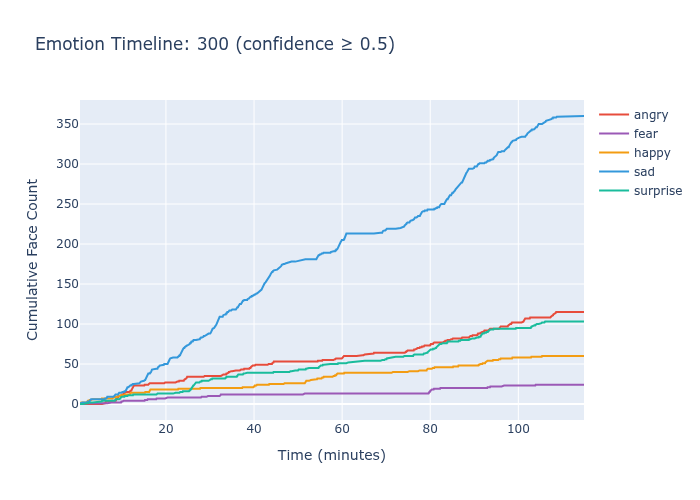

# Face Value: Emotion Recognition via Keyword-Based Weak Supervision

A computer vision project demonstrating that domain-matched weak supervision can outperform benchmark-trained models on ecological validation tasks, despite lower test accuracy.

## Project Overview

**Problem:** Standard emotion recognition datasets (FER2013, RAF-DB) achieve high benchmark accuracy but often fail to generalize to real-world validation tasks like movie analysis.

**Approach:** Train emotion classifiers using keyword-based weak supervision from stock photo platforms (Pexels, Pixabay), then validate on movie timelines to assess ecological validity.

**Key Finding:** Models trained on domain-matched data with weak supervision (80% accuracy) show more interpretable patterns and emotional diversity than models trained on curated datasets with 90% accuracy.

## TOC
- [Results Summary](#results-summary)
- [Technical Approach](#technial-approach)
- [Validation Methodology](#validation-methodology)
- [Limitations & Future Work](#limitations--future-work)
- [Repository Structure](#repository-structure)
- [Installation and Usage](#installation--usage)
- [Key Takeaways](#key-takeaways)
- [Citation and Contact](#citation--contact)
- [Acknowledgments](#acknowledgments)
- [License](#license)

Additional details available for [Methods](METHODS.md) and [Results](RESULTS.md).


## Results Summary

### Model Comparison

| Model | Test Accuracy | Movie Emotion Diversity (Entropy) | Narrative Patterns |
|-------|--------------|-----------------------------------|-------------------|
| Face Value (Weak Supervision) | 82% | 2.036 ± 0.18 | Interpretable |
| RAF-DB (Labeled Data) | 90% | 1.634 ± 0.21 | Minimal |
| FER2013 (Lab Dataset) | 71% | N/A | None (98% angry) |

#### Emotional Distribution by Movie 
Results show aggregated emotion counts by movie for both models using every 100th frame for analysis.

Face Value             |  RAF
:-------------------------:|:-------------------------:
  |  


### Key Findings

1. **Multi-keyword semantic breadth:** Combining multiple emotion keywords (`happy+smiling+joyful`) produces better results than single keywords, replicated across Pexels and Pixabay sources

2. **Domain matching matters:** Stock photos with emotional context better match movie expressions than lab poses (FER2013) or in-the-wild selfies (RAF-DB)

3. **Benchmark accuracy ≠ ecological validity:** The 90% accurate RAF-DB model collapses to predicting 'surprise' in 50% of movies with flat timelines, while the 67% accurate Face Value model captures narrative-relevant emotional shifts

4. **Minimal data requirements:** <5,000 total images across 5 emotion classes sufficient for meaningful patterns

## Technical Approach
[Back to Top](#toc)

### Data Collection & Curation

**Sources:** Pexels and Pixabay APIs  
**Keywords tested:**
- Single emotion: `[emotion] face` (e.g., "happy face")
- Multiple adjectives: `happy + smiling + joyful`
- Result: Multi-keyword approach consistently outperformed single-keyword

**Curation:**
- Automated keyword-based labeling
- Minimal manual filtering (dropped `disgust` and `neutral` classes)
- Final dataset: <4k images across 5 classes (angry, fear, happy, sad, surprise)

### Model Architecture

- **Base:** ResNet18 pretrained on ImageNet
- **Transfer learning:** Fine-tuned final layers
- **Face detection:** MediaPipe (state-of-the-art detector)
- **Framework:** PyTorch
- **Tracking:** MLflow for experiment management

### Training Details

- **Classes:** 5 emotions (angry, fear, happy, sad, surprise)
- **Training data:** An imbalanced sample ranging from <200 to over 1300 images per category
  - Sad: 796
  - Fear:	342
  - Happy: 1387
  - Angry:	1028
  - Surprise: 185
- **Validation split:** 20% (Note training data count is all data pulled before splitting)
- **Augmentation:** Standard (flips, rotations, color jitter)

## Validation Methodology
[Back to Top](#toc)

### Movie Timeline Analysis

**Approach:** Analyze ~60 full-length films, tracking emotion predictions every 100th frame to assess whether models capture narrative structure. Note movie selection is based on available digital collection, not a random or selected sampling.

**Success criteria:**
- Temporal variation rather than flat predictions
- Genre-appropriate emotion distributions (comedies show more happy, dramas show more sad)
- Emotional shifts align with key plot points (reunions, conflicts, resolutions)

### Example Validations

**Finding Nemo (Kids' Adventure):**
- Plot point: Nemo lost at ~14 minutes, reunited at ~84 minutes
- Face Value: Happy surge visible at reunion
- RAF-DB: Flat surprise accumulation, reunion not detected


Face Value             |  RAF
:-------------------------:|:-------------------------:
  |  


**Real Steel (Sports Drama):**
- Plot point: Redemption arc begins at ~90 minutes
- Face Value: Clear happy acceleration in final act
- RAF-DB: Linear surprise accumulation, no inflection

Face Value             |  RAF
:-------------------------:|:-------------------------:
  |  

**300 (Action, War):**
- Plot point: Lots of close up faces, with intense emotions
- Face Value: High levels of angry, sad and happy (Spartans like fighting)
- RAF-DB: Most negative expressions collapse into sad, one of the few films where surprise is not most common RAF prediction 

Face Value             |  RAF
:-------------------------:|:-------------------------:
  |  

## Limitations & Future Work
[Back to Top](#toc)

### Current Limitations

1. **Sad bias:** Model predicts 'sad' as dominant emotion in ~60% of movies, likely due to keyword-based training data over-representing neutral/contemplative expressions. 

2. **Subjective validation:** Timeline patterns assessed qualitatively; systematic quantitative validation needed

3. **Cherry-picked examples:** Timeline demonstrations show best cases; comprehensive pattern analysis across all films needed

4. **No ground truth:** Movie emotional arcs based on plot knowledge, not standardized annotations

### Future Directions

1. **Solve sad bias:** Investigate keyword selection, data balancing, or post-hoc calibration
2. **Systematic validation:** Quantitative metrics for timeline quality, inter-rater reliability
3. **Domain generalization:** Test on hand gestures, activities (demonstrating approach transfers)
4. **Ablation studies:** Isolate contribution of each keyword, data source effects

## Repository Structure
[Back to Top](#toc)

```
face-value/
├── configs/
│   ├── data_pull/        # Handles api/search criteria
│   └── training/         # Models, augmentation, hyperparameters
├── data/
│   ├── raw/              # Downloaded stock photos
│   ├── processed/        # Face crops, train/val splits
│   ├── FER-2013          # Standardized data
│   └── RAF-DF            # Standardized data
├── evaluation/           # Movie outputs/model
├── models/
│   ├── face_value/       # Trained model checkpoints
│   ├── raf_comparison/   # RAF-DB baseline
│   └── fer_comparison/   # FER2013 baseline
├── notebooks/
│   ├── model_metrics_and_comparison.ipynb
│   ├── movie_evaluation_and_comparison.ipynb
│   ├── training_file_face_value.ipynb 
│   ├── training_file_for_FER2013.ipynb
│   └── training_file_for_RAF.ipynb
├── src/
│   ├── api_pulls/            # API requests
│   ├── movie_evaluation/     # Movied specific analysis
│   ├── utils/                # Common shared functions
│   ├── batch_runner.py       # Run multiple trainings
│   ├── face_extraction.py    # Creates face images based on pulled data
│   ├── model_config.py       # Shared model and augmentation settings
│   └── train_from_config.py  # Train a single model
├── README.md                 # Project overview
├── METHODS.md                # Deeper dive into data curation/approach
├── RESULTS.md                # Deeper dive into comparison across models
└── environment.yml           # Packages and versions
```

## Installation & Usage
[Back to Top](#toc)

```bash
# Clone repository
git clone https://github.com/yourusername/face-value.git
cd face-value

# Install dependencies
conda env create -f environment.yml
```

### Additional Software/Access
  - MediaPipe FaceDetector
  - ResNet for Pytorch
  - API key for relevant sources

### Run Pipeline

```bash
# Pull data based on cofig
python src/api_pulls/pixabay_pull.py ../configs/data_pull/pixabay_v1.json

# Extract Faces
python src/face_extraction.py --raw_dir data/raw/pixabay_v1 --out_dir data/processed/pixabay_v1

# EDA/clean pulled data:
# notebooks/training_file_face_value.ipynb 

# Train model 
python src/train_from_config.py --config configs/training/pixabay_v1

# Model metrics (designed for multiple comparison and test datasets):
# notebooks/model_metrics_and_comparison.ipynb

# Run movie analysis with mlflow run id
python src/movie_evaluation/evaluate_movies.py \
    --run-id 21bec48063d549d4a97f6c8eaa1bd856 \
    --checkpoint models/pixabay_light_aug_v1/model.pt \
    --movies-dir ~/Movies \
    --movie-list src/movie_evaluation/movie_list.txt \
    --output-dir ../../evaluation/pixabay_v1/movies \
    --face-detector ../../models/mediapipe_face_detector/detector.tflite

# Movie evalutation:
# notebooks/movie_evaluation_and_comparison.ipynb

```

## Key Takeaways
[Back to Top](#toc)

**For ML Practitioners:**
- Benchmark accuracy doesn't guarantee real-world generalization
- Domain matching can be more important than data quality
- Weak supervision is viable for practical applications
- Validation methodology matters as much as model architecture

**For Applied Projects:**
- ~5,000 weakly-labeled images sufficient for meaningful patterns
- Multi-keyword search improves data quality
- Movie timelines provide interpretable validation
- Transfer learning + minimal data = practical approach

## Technical Stack

- **Languages:** Python 3.10+
- **ML Framework:** PyTorch
- **Base Architecture**: ResNet18
- **Data Processing:** Polars
- **Computer Vision:** MediaPipe (face detection), OpenCV
- **Visualization:** Plotly
- **Experiment Tracking:** MLflow
- **APIs:** Pexels, Pixabay

## Citation & Contact
[Back to Top](#toc)

### Citation
If you use this work, please cite:

```bibtex
@misc{lumian2025facevalue,
  author = {Lumian, Daniel},
  title = {Face Value: Emotion Recognition via Keyword-Based Weak Supervision},
  year = {2025},
  url = {https://github.com/pixel-process/face-value}
}
```
### Contact

Daniel Lumian, PhD  
[Dexterous Data](https://www.dexterousdata.com)  
dexterous.data.llc@gmail.com

For consulting inquiries on ML prototyping and validation methodology, please reach out.

## Acknowledgments
[Back to Top](#toc)

- Stock photo sources: Pexels and Pixabay APIs
- Face detection: MediaPipe by Google
- Base architecture: ResNet50 (PyTorch pretrained)
- Baseline datasets: RAF-DB, FER2013

## License
[Back to Top](#toc)

The MIT License (MIT)

Copyright (c) 2011-2025 The Bootstrap Authors

Permission is hereby granted, free of charge, to any person obtaining a copy
of this software and associated documentation files (the "Software"), to deal
in the Software without restriction, including without limitation the rights
to use, copy, modify, merge, publish, distribute, sublicense, and/or sell
copies of the Software, and to permit persons to whom the Software is
furnished to do so, subject to the following conditions:

The above copyright notice and this permission notice shall be included in
all copies or substantial portions of the Software.

THE SOFTWARE IS PROVIDED "AS IS", WITHOUT WARRANTY OF ANY KIND, EXPRESS OR
IMPLIED, INCLUDING BUT NOT LIMITED TO THE WARRANTIES OF MERCHANTABILITY,
FITNESS FOR A PARTICULAR PURPOSE AND NONINFRINGEMENT. IN NO EVENT SHALL THE
AUTHORS OR COPYRIGHT HOLDERS BE LIABLE FOR ANY CLAIM, DAMAGES OR OTHER
LIABILITY, WHETHER IN AN ACTION OF CONTRACT, TORT OR OTHERWISE, ARISING FROM,
OUT OF OR IN CONNECTION WITH THE SOFTWARE OR THE USE OR OTHER DEALINGS IN
THE SOFTWARE.

---

**Note:** This is a research and portfolio project demonstrating applied ML methodology. The models are not intended for production use without further validation and bias mitigation.

**Model Availability:** Pre-trained weights are not provided as the model is easily reproducible in 2-3 hours using the provided training pipeline. The full codebase, training configuration, and dataset collection scripts are included for complete reproducibility. For specific use cases requiring pre-trained weights, please contact dexterous.data.llc@gmail.com.

[Back to Top](#toc)
