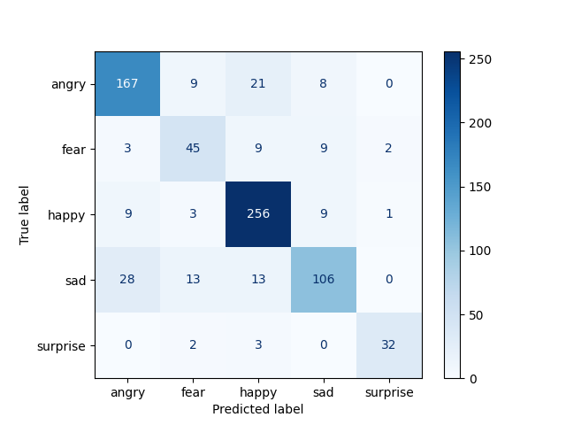
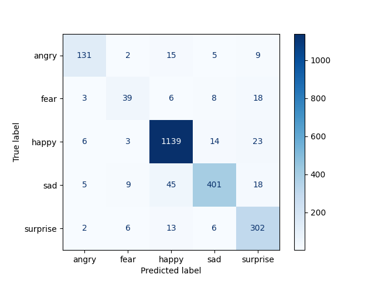
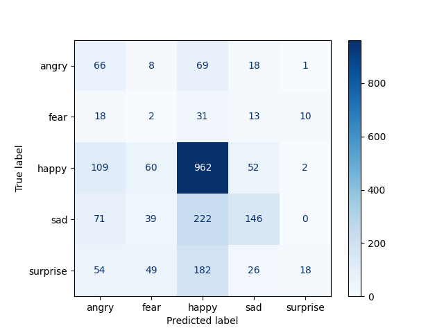

# Face Value: Results

## Metrics 

## Search Format and Performance

| Data Source | Face Specific  | Multi-Keyword | Combined |
|-------------|----------------|---------------|----------|
| Pexels      | 69% acc        | 51% acc       | 64% acc  |
| Pixabay     | 56% acc        | 60% acc       | 82% acc  |
| Combined    | 62% acc        | 64% acc       | 69% acc  |

Two search patterns were used: 
- Face specific ("happy face")
- Multi-keyword approaches ("happy", "smiling", "joyful") 

Combining results from **within** a source consistently outperformed either approach individually. 

Disgust was dropped from analysis due to low hits.

Neutral was dropped due to ambiguity, future work may consider low-confidence predictions on the trained emotions an indicator of neutral type expression.

### Key words
- **angry**: "angry", "mad", "irate"
- **disgust**: "disgusted", "gross", "repulsed"
- **fear**: "fear", "afraid", "scared"
- **happy**: "happy", "smiling", "joyful"
- **sad**: "sad", "crying", "unhappy"
- **surprise**: "surprised", "shocked", "astonished"
- **neutral**: "neutral", "calm", "expressionless"

## Face Value Model: Pixabay

The final model chosen for comparison was based on Pixabay data only using both search types.

### Classification Metrics

```text
              precision    recall  f1-score   support

       angry       0.81      0.81      0.81       205
        fear       0.62      0.66      0.64        68
       happy       0.85      0.92      0.88       278
         sad       0.80      0.66      0.73       160
    surprise       0.91      0.86      0.89        37

    accuracy                           0.81       748
   macro avg       0.80      0.78      0.79       748
weighted avg       0.81      0.81      0.81       748
```

### Confusion Matrix 



## RAF-DB Model: Test Metrics
Standard test set for evaluation of RAF-DF models. Represents internal validity of model to this dataset.

### Classification Metrics
 
```text
              precision    recall  f1-score   support

       angry       0.89      0.81      0.85       162
        fear       0.66      0.53      0.59        74
       happy       0.94      0.96      0.95      1185
         sad       0.92      0.84      0.88       478
    surprise       0.82      0.92      0.86       329

    accuracy                           0.90      2228
   macro avg       0.85      0.81      0.83      2228
weighted avg       0.90      0.90      0.90      2228
```
### Confusion Matrix



## FV on RAF Test

For better insight, the FV model was tested against the RAF test data. Performance was poor. 

```text
              precision    recall  f1-score   support

       angry       0.21      0.41      0.28       162
        fear       0.01      0.03      0.02        74
       happy       0.66      0.81      0.73      1185
         sad       0.57      0.31      0.40       478
    surprise       0.58      0.05      0.10       329

    accuracy                           0.54      2228
   macro avg       0.41      0.32      0.30      2228
weighted avg       0.57      0.54      0.51      2228
```

### Confusion Matrix

